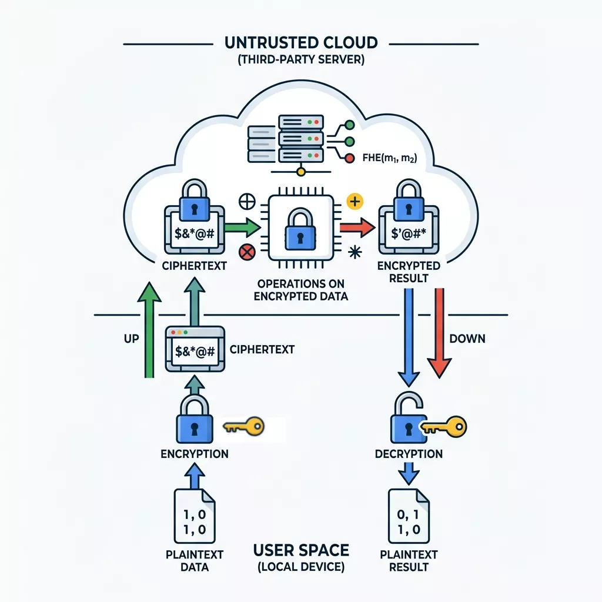

The FHE Team at Google, in partnership with multiple collaborators,
is working to

Unlock [Fully Homomorphic Encryption](https://en.wikipedia.org/wiki/Homomorphic_encryption#Fully_homomorphic_encryption) for Google and the world.

- Make it Easy
- Make it Fast
- at Scale

What started with a C++ transpiler, has morphed into two new libraries:

- [HEIR](https://github.com/google/heir) is the new development platform and
compiler toolchain for converting existing models to their FHE versions
supporting multiple FHE schemes
and backends.
- [Jaxite](https://github.com/google/jaxite) is a fully homomorphic encryption
backend targeting TPUs and GPUs,
written in JAX.

Note: Looking for the original "Google Transpiler" project? See the [archived
codebase](https://github.com/google/fully-homomorphic-encryption/releases/tag/transpiler)
