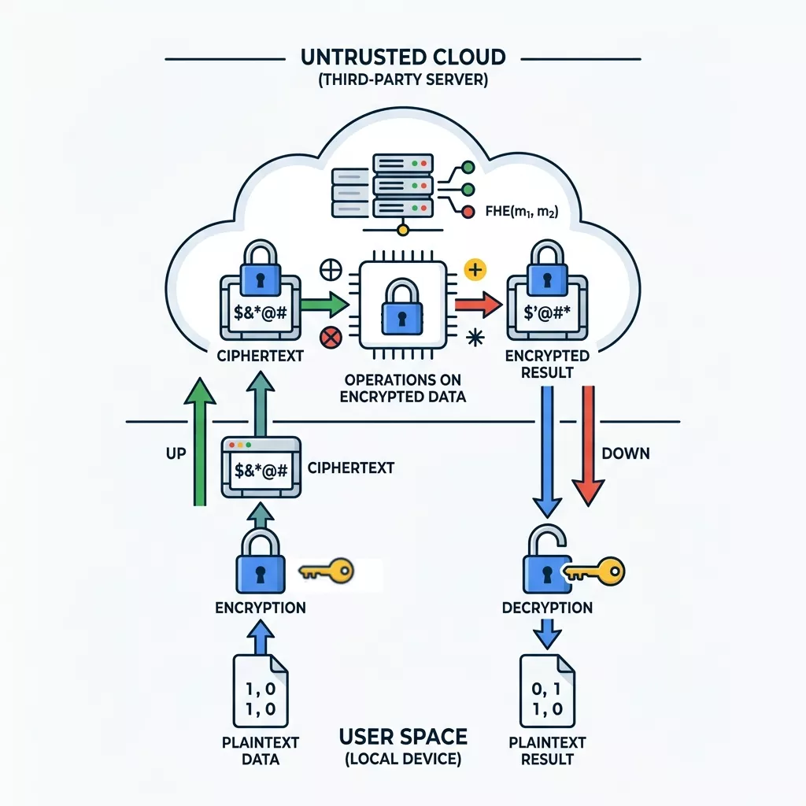

### [HEIR](https://github.com/google/heir): The Future of Fully Homomorphic Encryption

HEIR is revolutionizing privacy-preserving computation with a simple mantra:
**Make it easy, Make it fast, Make it scale.**

- **Make it easy:** HEIR serves as a powerful development platform and compiler
toolchain that automates the conversion of existing models into FHE-compatible
versions.
- **Make it fast:** By supporting multiple FHE schemes and high-performance backends, HEIR ensures your encrypted workloads run with optimal efficiency.
- **Make it scale:** Leveraging [MLIR](https://mlir.llvm.org/) (Multi-level
Intermediate Representation), HEIR provides the abstraction necessary to
represent and scale complex models across diverse dialects.

Check out the [FHE Demos repository](https://github.com/google/fully-homomorphic-encryption/tree/main/demos#readme) to see HEIR in action! The team, with help from close collaborators, is currently tackling a variety of models, including CNNs, to unlock transformative use cases for developers—all without requiring you to master cryptography or the complex nuances of FHE.

### A little History

What started with a C++ transpiler 5 years ago, morphed into two new Open
Source libraries:

- [HEIR](https://github.com/google/heir) which stands for *Homomorphic
Encryption Intermediate Representation*
is an MLIR-based toolchain for homomorphic encryption compilers.
- [Jaxite](https://github.com/google/jaxite) is a fully homomorphic encryption
backend targeting TPUs and GPUs,
written in JAX.

Note: Looking for the original "Google Transpiler" project? See the [archived
codebase](https://github.com/google/fully-homomorphic-encryption/releases/tag/transpiler)

### Reach out
Interested in working with us on FHE, HEIR, or Jaxite?
Check out [HEIR Community Outreach Links](https://heir.dev/community/)

### What is [Fully Homomorphic Encryption](https://en.wikipedia.org/wiki/Homomorphic_encryption)?

FHE is a breakthrough privacy technology that allows computers to process data
while it remains encrypted. Unlike standard encryption, which protects data
only when idle, FHE ensures your information stays private even while it is
being processed.

#### How It Works
**Encrypted Computation:** Traditional systems must decrypt data to process it. FHE allows mathematical operations—like addition and multiplication—to be performed directly on encrypted "ciphertext."

**The Result:** When the final result is decrypted, it yields equivalent
results, as if the operations had been performed on the original,
unencrypted data.

**Evolution:** Long a theoretical concept, FHE has matured into a practical
tool, with current research focused on optimizing speed and efficiency for
everyday workloads.

#### Impact for Private Inference

FHE eliminates the trade-off between privacy and data utility.
It is critical for:

- **Zero-Exposure Processing:**
Data remains encrypted from start to finish,
protecting sensitive inputs from server-side exposure or unauthorized access.
- **Secure AI/ML:**
Organizations can run powerful AI models—like medical
diagnostic tools or financial analysis—on cloud platforms without ever
revealing the underlying sensitive user data or proprietary model weights.
- **Regulatory Compliance:**
It enables safe analysis of restricted datasets
in highly regulated fields like healthcare and finance, meeting stringent
data sovereignty requirements.
- **Layered Privacy:**
FHE serves as a core computational layer in modern
security stacks, often working alongside differential privacy and confidential
computing to provide robust, multi-layered protection.

