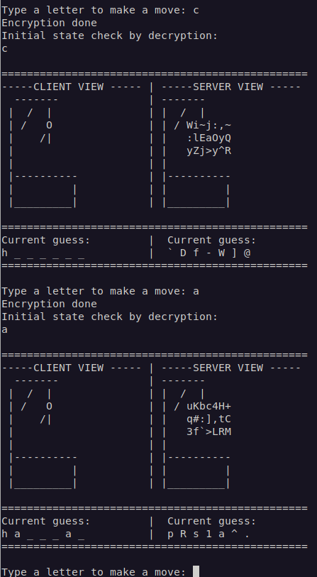
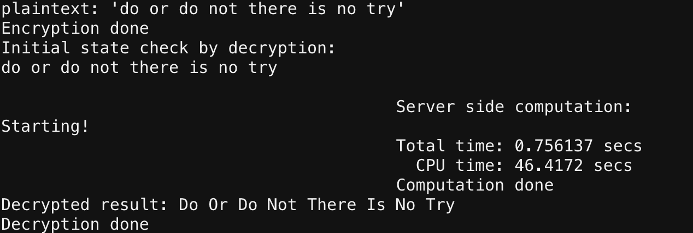

# Fully Homomorphic Encryption (FHE) C++ Transpiler

The FHE C++ Transpiler is an open-sourced technology that will allow any C++
developer to perform transformations on encrypted data without decrypting it.

This transpiler connects Google’s [XLS library](https://google.github.io/xls/)
to multiple FHE backends (currently the
[TFHE library](https://tfhe.github.io/tfhe/) and
[OpenFHE](https://openfhe.org/)'s BinFHE library). It will allow developers
(including those without expertise in cryptography) to write code that runs on
encrypted data, without revealing the data contents or the computations’ result.
This system should help lay the groundwork for further advancements on practical
FHE systems.

This system is currently only supported on Linux, and requires GCC version 9 (or
later) and
[Bazel 4.0.0](https://docs.bazel.build/versions/master/bazel-overview.html).

This is currently an exploratory proof-of-concept. While it could be deployed in
practice, the run-times of the FHE-C++ operations are likely to be too long to
be practical at this time. This transpiler heavily relies on the chosen FHE
library for security guarantees. Since both the OpenFHE and TFHE libraries are
relatively new, there are not yet robust widely-accepted cryptanalyses for them.
Thus, before including this system's output in a live production deployment, be
aware that there may be yet undiscovered vulnerabilities in either library.

## Quick start

This section describes how to install and run the FHE C++ Transpiler. If you
have any problems, please see the [Troubleshooting](#troubleshooting) section
near the bottom of this document.

### Install the FHE C++ Transpiler

This repository offers two ways to install the FHE C++ Transpiler.

#### Option A: Install the transpiler on your Linux machine

In order to install the FHE C++ Transpiler on your Linux machine:

1.  Install
    [Bazelisk](https://docs.bazel.build/versions/master/install-bazelisk.html)
    to run the bazel build system. This will use the bazel version defined in
    `.bazelversion` in the repository root.

2.  Install the following additional required packages using your Linux
    distribution's package manager:

    *   `gcc` in version 9 or higher.
    *   `git`, which is required for downloading some dependencies using Bazel.
    *   `libtinfo5` or `ncurses5-compat-libs`
    *   `python2`
    *   `python3`
    *   `python3-pip`
    *   `bison` (for `yosys`)
    *   `flex` (for `yosys`)

    You can install all of the above by running the following commands,
    depending on you distribution.

    *   On Debian-based distributions:

        ```shell
        sudo apt install gcc git libtinfo5 python python3 python3-pip bison flex
        ```

    *   On Arch-based distributions with [AUR](https://aur.archlinux.org)
        enabled:

        ```shell
        sudo pacman -Syu gcc git ncurses5-compat-libs python2 python python-pip \
        bison flex
        ```

3.  Download
    [the latest version of this repository](https://github.com/google/fully-homomorphic-encryption/archive/refs/heads/main.zip)
    and extract it. Alternatively, you can use `git` to clone the repository on
    your local machine using the following command:

    ```shell
    git clone https://github.com/google/fully-homomorphic-encryption.git
    ```

#### Option B: Use Docker to install the transpiler

1.  [Install Docker for your platform](https://docs.docker.com/get-docker/)

2.  Download
    [the latest version of this repository](https://github.com/google/fully-homomorphic-encryption/archive/refs/heads/main.zip)
    and extract it. Navigate to the extracted folder. Alternatively, you can
    also use `git` to clone the repository using the following command:

    ```shell
    git clone https://github.com/google/fully-homomorphic-encryption.git
    ```

3.  **(macOS only)** Ensure sufficient Docker system resources for macOS:
    Navigate to `Preferences` > `Resources` > `Advanced` and set the runtime
    memory limit to at least 6GB. The default settings for other system
    resources (swap, disk size, etc.) should be sufficient. In our tests on a
    2017 MacBook Pro, these defaults were set to:

    *   CPU: 4 cores
    *   Swap: 1GB
    *   Disk image: 60GB

    Note that increases to these other system resources may help improve image
    build times and container performance. See more about setting resource
    limits in Docker Desktop
    [here](https://docs.docker.com/docker-for-mac/#resources).

4.  Navigate to the root of this repository, which contains the `Dockerfile` and
    run

    ```shell
    docker build -t google-fhe-transpiler -f docker/debian-bullseye.Dockerfile .
    ```

    This may take around 1 hour, depending on your system configuration.

5.  Execute `docker run --rm -i -t google-fhe-transpiler bash` to connect to a
    fresh instance that has the transpiler installed. You can then run the
    examples as described in the following section.

### Running the FHE C++ Transpiler

To run the FHE C++ Transpiler, go to the `fully-homomorphic-encryption/`
directory that contains the FHE C++ Transpiler code, and run the following
command to start the `hangman` demo:

```shell
bazel run //transpiler/examples/hangman:hangman_client
```

This will automatically build the core FHE C++ Transpiler toolchain, which may
take a long time (i.e., over an hour) when building the first time. Once the
demo is running, a game of
[Hangman](https://en.wikipedia.org/wiki/Hangman_\(game\)) will be playable,
illustrating that the player's letter guesses and game progress are unknown to
the server.

### Transpiling your code

To run the FHE C++ Transpiler on your own C++ code, follow these steps:

1.  Create a subdirectory in `fully-homomorphic-encryption/transpiler/examples/`
    (e.g., `fn`).
2.  Add the C++ file that contains the code to be transpiled into the
    aforementioned subdirectory.
3.  Create a testbench (e.g., `fn_tfhe_testbench`) and `BUILD` file similar to
    those in the repository’s examples, but that uses your FHE-C++ instead.
4.  Run the transpiler with the following command, replacing `fn` with the name
    of your subdirectory and testbench file names, followed by two dashes, and
    any needed additional arguments (e.g., `"arg1"`, `"arg2"`):

```shell
bazel run //transpiler/examples/fn:fn_tfhe_testbench -- "arg1" "arg2"
```

A more comprehensive guide on building your own demo can be found at
[g3doc/build_your_own_demo.md](./g3doc/build_your_own_demo.md).

## Demos

This section lists the demos included in this repository that are intended to be
simple, yet effective, examples of possible uses for the FHE C++ Transpiler.

There are also `bazel` commands to compile and run each demo. For demos with a
choice of two commands, the first "baseline" command generates FHE-C++ that uses
only a single processor core (i.e., slow), while the second "interpreter"
command generates FHE-C++ that utilizes multiple cores (i.e., significantly
faster). Both commands assume your working directory is within the workspace
`fully-homomorphic-encryption/`.

**Note:** All demos are for illustrative purposes only, and are not designed for
live production deployments. For example, the demos' encryption keys all use a
hard coded simple seed, which is not secure in a production service. Live
production deployments should use cryptographically secure seeds that are
securely stored, as well as implement all appropriate design, security, privacy,
and other best practices.

### Calculator

The Calculator demo adds, subtracts, or multiples two encrypted short integers,
without the server knowing the integers or the result.

*   Baseline FHE-C++ translation command:
    *   Using TFHE: `shell bazel run
        //transpiler/examples/calculator:calculator_tfhe_testbench`
    *   Using OpenFHE: `shell bazel run
        //transpiler/examples/calculator:calculator_openfhe_testbench`
*   Multi-core interpreter command:
    *   Using TFHE: `shell bazel run
        //transpiler/examples/calculator:calculator_interpreted_tfhe_testbench`
    *   Using OpenFHE `shell bazel run
        //transpiler/examples/calculator:calculator_interpreted_openfhe_testbench`

### Fibonacci

The Fibonacci demo calculates the sum of the Fibonacci sequence up to the
n<sup>th</sup> integer in the sequence.

*   TFHE-rs multi-threaded translation command:
    *   Using TFHE-rs: ```shell bazel run 
        //transpiler/examples/fibonacci:fibonacci_rs_main ```

*   Baseline FHE-C++ translation command:
    *   Using TFHE: `shell bazel run
        //transpiler/examples/fibonacci:fibonacci_tfhe_testbench`
    *   Using OpenFHE: `shell bazel run
        //transpiler/examples/fibonacci:fibonacci_openfhe_testbench`
*   Multi-core interpreter command:
    *   Using TFHE: `shell bazel run
        //transpiler/examples/fibonacci:fibonacci_interpreted_tfhe_testbench`
    *   Using OpenFHE: `shell bazel run
        //transpiler/examples/fibonacci:fibonacci_interpreted_openfhe_testbench`

### Hangman

The Hangman demo is a classical game of Hangman, but with privacy. The server
does not know which letters the player is choosing or whether they won or lost.

```shell
bazel run //transpiler/examples/hangman:hangman_client
```



### Private information retrieval

This demo highlights single-server private information retrieval (PIR). User-
provided characters are retrieved by index without the server knowing the query
or the data it's storing. This is an O(N) operation, where N is the number of
records in the database.

*   Baseline FHE-C++ translation command: `shell bazel run
    //transpiler/examples/pir:pir_client`
*   Multi-core interpreter command: `shell bazel run
    //transpiler/examples/pir:pir_interpreted_client`

### Reverse string

This demo reverses an encrypted string without the server knowing the string.

*   Baseline FHE-C++ translation command: `shell bazel run
    //transpiler/examples/string_reverse:string_reverse_tfhe_testbench "hello"`
*   Multi-core interpreter command: `shell bazel run
    //transpiler/examples/string_reverse:string_reverse_interpreted_tfhe_testbench
    "hello"`

### Add one

This simple demo adds 1 to an integer.

*   Jaxite Command: `shell bazel run
        //transpiler/examples/add_one:add_one`

### Simple sum

This demo adds two encrypted integers without the server knowing either integer
or the resulting sum.

*   Baseline FHE-C++ translation command:
    *   Using TFHE: `shell bazel run
        //transpiler/examples/simple_sum:simple_sum_tfhe_testbench`
    *   Using OpenFHE: `shell bazel run
        //transpiler/examples/simple_sum:simple_sum_openfhe_testbench`
*   Multi-core interpreter command:
    *   Using TFHE: `shell bazel run
        //transpiler/examples/simple_sum:simple_sum_interpreted_tfhe_testbench`
    *   Using OpenFHE: `shell bazel run
        //transpiler/examples/simple_sum:simple_sum_interpreted_openfhe_testbench`

### String capitalization

In this demo, each word in an encrypted sentence can be capitalized without the
server knowing the sentence.

There are two versions of this demo:

1.  In the `string_cap` example, the FHE-C++ code inputs the entire encrypted
    string and internally iterates over each character.

    *   Baseline FHE-C++ translation command:
        *   Using TFHE: `shell bazel run
            //transpiler/examples/string_cap:string_cap_tfhe_xls_transpiled_testbench --
            "do or do not; there is no try"`
        *   Using OpenFHE: `shell bazel run
            //transpiler/examples/string_cap:string_cap_openfhe_xls_transpiled_testbench --
            "do or do not; there is no try"`
    *   Multi-core interpreter command:
        *   Using TFHE: `shell bazel run
            //transpiler/examples/string_cap:string_cap_tfhe_xls_interpreted_testbench --
            "do or do not; there is no try"`
        *   Using OpenFHE: `shell bazel run
            //transpiler/examples/string_cap:string_cap_openfhe_xls_interpreted_testbench --
            "do or do not; there is no try"`

2.  In the `string_cap_char` example, the FHE-C++ code operates on one character
    at a time. This example can provide more output regarding the string
    transformation process, for illustrative purposes.

    *   Baseline FHE-C++ translation command:
        *   Using TFHE: `shell bazel run
            //transpiler/examples/string_cap_char:string_cap_char_tfhe_xls_transpiled_testbench --
            "do or do not; there is no try"`
        *   Using OpenFHE: `shell bazel run
            //transpiler/examples/string_cap_char:string_cap_char_openfhe_xls_transpiled_testbench --
            "do or do not; there is no try"`
    *   Multi-core interpreter command:
        *   Using TFHE: `shell bazel run
            //transpiler/examples/string_cap_char:string_cap_char_tfhe_xls_interpreted_testbench --
            "do or do not; there is no try"`
        *   Using OpenFHE: `shell bazel run
            //transpiler/examples/string_cap_char:string_cap_char_openfhe_xls_interpreted_testbench --
            "do or do not; there is no try"` ```



### Integer square root

This demo computes the square root of an encrypted short integer, without the
server knowing the input or the result.

*   Baseline FHE-C++ translation command:
    *   Using TFHE: `shell bazel run
        //transpiler/examples/sqrt:sqrt_tfhe_testbench -- 15875`
    *   Using OpenFHE: `shell bazel run
        //transpiler/examples/sqrt:sqrt_openfhe_testbench -- 15875`
*   Multi-core interpreter command:
    *   Using TFHE: `shell bazel run
        //transpiler/examples/sqrt:sqrt_interpreted_tfhe_testbench -- 15875`
    *   Using OpenFHE: `shell bazel run
        //transpiler/examples/sqrt:sqrt_interpreted_openfhe_testbench -- 15875`

### Rock paper scissors

This demo allows to you to play
[rock paper scissors](https://en.wikipedia.org/wiki/Rock_paper_scissors) with
the server. The input of the players is provided and the server will evaluate
the outcome of the game, without discovering the input or the outcome.

*   Baseline FHE-C++ translation command: `shell bazel run
    //transpiler/examples/rock_paper_scissor:rock_paper_scissor_tfhe_testbench
    PLAYER_A PLAYER_B`

*   Multi-core interpreter command: `shell bazel run
    //transpiler/examples/rock_paper_scissor:rock_paper_scissor_interpreted_tfhe_testbench
    PLAYER_A PLAYER_B`

where `PLAYER_A` and `PLAYER_B` are the choice `R` (rock), `P` (paper), or `S`
(scissors). The server will return the winning player (i.e., either `A` or `B`)
or `=` in the case of a tie.

### Structs & Templates

These subdirectories include examples of programming using structs and
templates, respectively: how structs can be used both inside and outside the FHE
environment and how templates can be used within the FHE environment to tailor
code to more precise specifications. Since they are not functional examples, we
mostly provide only TFHE testbenches, e.g.:

```shell
bazel run -c opt //transpiler/examples/structs:struct_with_struct_array_tfhe_testbench
```

and

```shell
bazel run -c opt //transpiler/examples/templates:mul_interpreted_tfhe_testbench
```

## Design

See detailed design at
[g3doc/transpiler_design.md](./g3doc/transpiler_design.md).

## Security

This section explains the FHE C++ Transpiler's threat model and the estimated
bits of security provided by the system's choice of
[TFHE parameters](https://tfhe.github.io/tfhe/security_and_params.html).

### Threat model

The FHE C++ Transpiler is built with the honest-but-curious-server threat model
in mind.

TFHE guarantees that, without the decryption key, the only information that a
collection of FHE ciphertexts (i.e., `LweSample*`) reveals about the encrypted
plaintexts is the data type when used correctly. The computed function (i.e.,
transform) is assumed to be known by both server and client.

### Bits of security

Given the parameters our testbenches use for
[TFHE](https://tfhe.github.io/tfhe), we currently estimate (using the
[TFHE estimator](https://github.com/tfhe/tfhe#estimator-code)) that the FHE C++
Transpiler provides between 97 and 127 bits of security based on
[this running-time estimator for solving LWE instances](https://bitbucket.org/malb/lwe-estimator/src/master/).

To ensure secure usage of the FHE C++ Transpiler, we recommend following the
guidance given in the
[TFHE security estimates and parameter choices documentation](https://github.com/tfhe/tfhe#security-estimates-and-parameter-choices).
Should you wish to modify the TFHE parameters and estimate the resulting bits of
security, be aware that the estimators might not be completely up to date, so
proceed with caution.

## Limitations

This section describes known limitations of the FHE C++ Transpiler.

Due to the transpiler's dependency on
[XLS[cc]](https://github.com/google/xls/tree/main/xls/contrib/xlscc), they share
the following limitations:

*   Variable-length arrays are not supported, since there is no way to inspect
    the contents of the variable before trying to access it (which is the main
    benefit of FHE). One workaround is to use arrays with the largest number of
    values that may be needed. This also protects privacy since array sizes will
    not be leaked.
*   While-loops and for-loops with a variable end-condition are not supported.
    This is because FHE evaluates all code branches, which requires knowing the
    number of loop iterations beforehand. See
    [this XLS feature request](https://github.com/google/xls/issues/387) for
    updates. One workaround is to set the for-loop to terminate after the most
    expected number of iterations and add an if-statement that will cause the
    for-loop break once the index reaches the variable length instead. This is
    illustrated in the following code:
*   Floating-point data types are not supported.

```cpp
#pragma hls_top
int some_func(int image[8], int length) {
  int sum = 0;

  #pragma hls_unroll yes
  for (int i = 0; i < 8; i++) { // "length" would not be visible on this line
    sum += image[i];
      if(i == (length-1))
        break;
  }
  return sum;
}
```

## Future work

In the near future, we intend to add additional optimizations to the interpreter
in the FHE IR Translation stage that will be especially useful for heterogeneous
compute environments, such as mixed CPU/GPU execution.

## Troubleshooting

Here are possible solutions to known issues with the FHE C++ Transpiler. If you
encounter an issue that is not addressed here, please file an issue on GitHub
describing the problem in as much detail as possible.

### Bazel requires `python` binary when both already installed

If Bazel requires a `python` binary present, but the `python2` and `python3`
binaries are already installed<sup>[1](#python2-and-python3)</sup>, this can be
fixed by creating a symlink to from `python` to `python2` with the following
command:

```shell
ln -s /usr/bin/python2 /usr/bin/python
```

### Bazel reports "Unknown LLVM Release"

If Bazel reports an error about an unknown LLVM release, try replacing the
`llvm_version` in the [`WORKSPACE`](../WORKSPACE) file from `10.0.0` to
`10.0.1`.

## Related projects

*   [XLS](https://github.com/google/xls), the Software Development Kit (SDK) for
    the End of Moore's Law (EoML) era.
*   [TFHE Library](https://github.com/tfhe/tfhe), Fast Fully Homomorphic
    Encryption Library
*   [OpenFHE Library](https://github.com/openfheorg/openfhe-development), OpenFHE BinFHE
*   [Jaxite](https://github.com/google/jaxite), Jaxite
*   [TFHE-rs](https://github.com/zama-ai/tfhe-rs), TFHE-rs
*   [Yosys](https://github.com/YosysHQ), Yosys
*   [ABC](https://github.com/berkeley-abc/abc), ABC
*   [HEIR](https://github.com/google/heir), Homomorphic Encryption Intermediate Representation

## Endnotes

<a name="python2-and-python3">1</a>: Both `python2` and `python3` are required
for this system because it uses the [LLVM](https://www.llvm.org/) toolchain
(which requires `python2`) and [XLS](https://google.github.io/xls) (which
requires `python3`).
