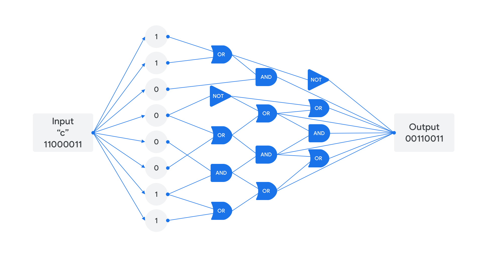
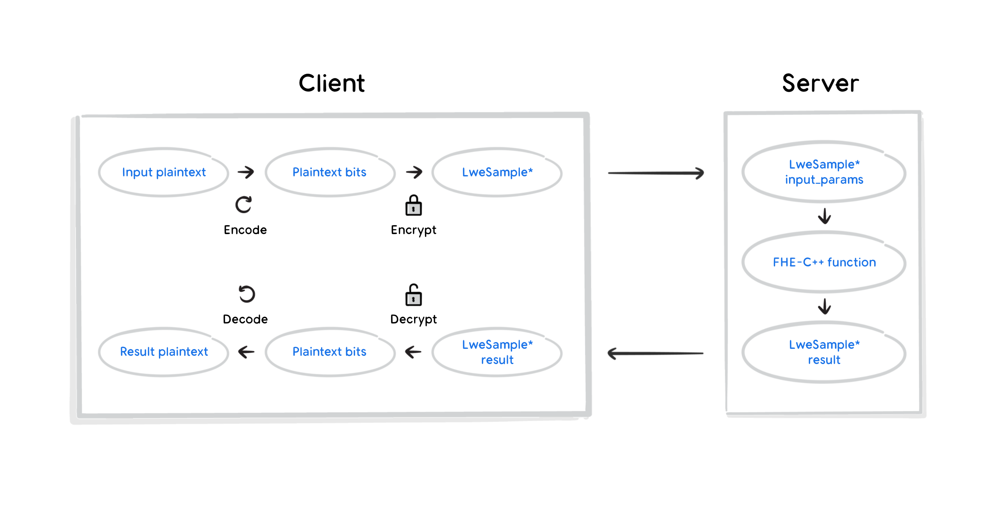

## Design

The FHE C++ Transpiler is designed to run sequentially through each of the
following five stages:

1.  The **XLS[cc] stage** translates a C++ function into an [XLS intermediate
    representation (IR)](https://google.github.io/xls/ir_semantics/).
2.  The **Optimizer stage**
    [optimizes the XLS IR](https://google.github.io/xls/optimizations/).
3.  The **Booleanifier stage**
    [re-writes the XLS IR](https://github.com/google/xls/blob/main/xls/tools/booleanify_main.cc)
    in terms of its operations' fundamental boolean operations (e.g., AND, OR,
    NOT).
4.  The **FHE IR Transpiler stage** translates the Booleanified XLS IR into
    FHE-C++.
5.  The **FHE testbench stage** runs the FHE-C++ with the appropriate library:
    either [TFHE](https://tfhe.github.io/tfhe/) or
    [OpenFHE](https://openfhe.org/)'s BinFHE.

This system includes the code for the first four stages, but users of this
transpiler will need to write their own C++ code to be transpiled, as well as
the FHE testbench for the fifth stage. The included examples have testbenches
that illustrate how new testbenches can be structured.

Below are more details about each of the listed stages.

### XLS[cc] stage

This stage converts a C++ program into an [XLS intermediate representation (IR)](https://google.github.io/xls/ir_semantics/).

### Optimizer stage

In this stage, the XLS IR produced in the previous stage is optimized. For more
information, see the [XLS Optimizer documentation](https://google.github.io/xls/optimizations/).

### Booleanifier stage

Two things of note occur during this stage. First, the optimized XLS IR is
re-written in terms of its operations' fundamental Boolean operations (e.g.,
AND, OR, NOT). Next, all operations are modified to be carried out on individual
bits (since [TFHE](https://tfhe.github.io/tfhe/) and
[OpenFHE](https://openfhe.org/) BinFHE both encrypt data one bit at a time).

This produces a Booleanified graph representing the operations
to perform. See the illustration below for an example.

For more information, see the [XLS Booleanifier code](https://github.com/google/xls/blob/main/xls/tools/booleanify_main.cc).

### FHE IR Translation stage

The system includes two options for this stage:

1.  By default, the FHE IR Transpiler parses the Booleanified graph and
    traverses it in topological-sort order.

2.  Alternatively, the FHE IR Interpreter does the same as the aforementioned
    FHE IR Transpiler, but also provides more flexibility in execution
    strategies, including multicore dispatch for improved performance. This
    should be especially useful for heterogeneous compute environments, such as
    mixed CPU/GPU execution. Once the interpreter has been more robustly tested,
    it will eventually replace the aforementioned FHE IR Transpiler.

Ultimately, both options output C++ code that operates on encrypted input.

### FHE testbench stage

Users of the transpiler must write their own FHE testbench for this stage.

The TFHE examples included in this repository have testbenches that simulate a
client-server interaction as described and illustrated below.

1.  The client encodes the input data into individual bits.
2.  The client encrypts the input bits into `LWESample`s. Each
    `LWESample` represents one bit of data.
3.  The client sends the `LWESample`s to the server.
4.  The server transforms the `LWESample`s with its TFHE C++ function. This
    function was constructed by the preceding four stages described above.
5.  The server sends the transformed `LWESample`s to the client.
6.  The client decrypts the transformed `LWESample`s into the transformed
    bits of data.
7.  The client decodes the transformed bits of data into the transformed output
    data.

The OpenFHE testbenches are similar, handling `LWECiphertext`s rather than
`LWESample`s.

While this repository does not include a working example of the client and
server deployed on separate machines, it should be possible to implement a
system that performs FHE C++ operations over a network using this transpiler.
